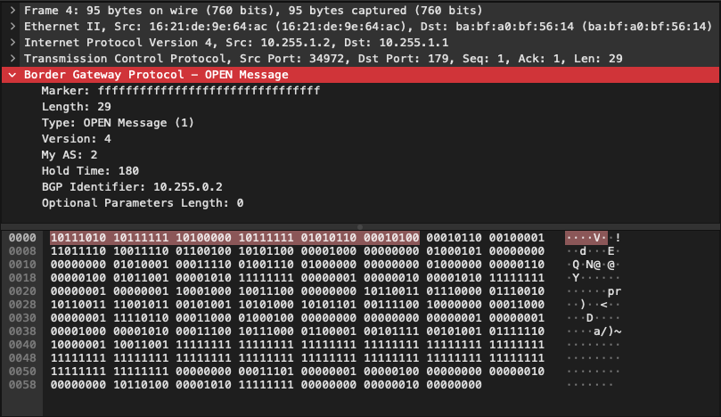

# FRRでBGP perrが貼れる様なBGPを作る(1)
### [wiresharkでBGP OPEN Messageを確認]

一方的にOPEN Messageを送信する  
dev03ではconfigファイルの様なものを用意し、MyASやidを変更しやすい様に  

- Usage: 
~~~
$ ./mybgp [-hsr] 
-h: Help.
-s: Sender.
-r: Reciever.
~~~

- 実行例
~~~
### R1 ###
root@R1:/home# ./mybgp -s
Server Side.
Waiting for connection ...
--------------------
-----BGP HEADER-----
Marker:  ff ff ff ff ff ff ff ff ff ff ff ff ff ff ff ff 
Len: 29
Type: 1
-----OPEN MSG-----
Version: 4
MyAS: 2
HoldTime: 180
Id: 10.255.1.2
Opt_Len: 0
~~~

