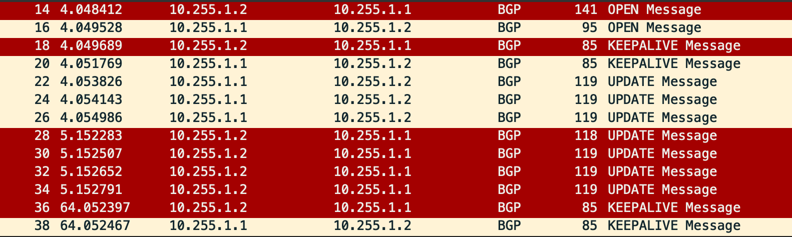

# 自作BGPとFRR間でメッセージのやりとりを行う.
* Establishedから拡張.
* Update Msg の交換を実装.
* FRR で パス属性が認識されていることを確認.
* pcap 要素を実装.
* 受信した BGP Msg の詳細をターミナルに表示.

---
### Usage: 
'''
    $ ./mybgp conf.json 
    The json file describes the configuration.
'''
    

---
### Json File:
- 記述例.
'''json
    {
        "router_bgp": 1, 
        "router_id": "1.1.1.1", 
        "neighbors": [
            { "address": "10.255.1.2", "remote_as": 2 }
        ],
        "address_familly": {
            "ipv4_unicast": {
                "networks": [
                    { "address": "10.1.0.0", "prefix_len": 24 },
                    { "address": "10.2.0.0", "prefix_len": 24 },
                    { "address": "10.255.1.0", "prefix_len": 24 }
                ]
            }
        }
    }
'''

---
### 実行例.
'''
    root@R1:/work# ./mybgp conf.json 
    --------------------
    Loaded the following settings.
    > myas  : 1
    > id    : 1.1.1.1
    > neighbor_address: 10.255.1.2
    > remote_as       : 2
    > networks prefix[0]:  10.1.0.0/24
    > networks prefix[1]:  10.2.0.0/24
    > networks prefix[2]:  10.255.1.0/24

    --------------------
    Trying to connect to 10.255.1.2 

    --------------------
    Sending OPEN MSG...

    --------------------
    Recvd BGP OPEN MSG...
    Marker:  ff ff ff ff ff ff ff ff ff ff ff ff ff ff ff ff 
    Len:  75
    Type: 1
    Version:  4
    MyAS:     2
    HoldTime: 180
    Id:       2.2.2.2
    Opt_Len:  46

    --------------------
    Sending KEEPALIVE MSG...

    --------------------
    Recvd BGP KEEPALIVE MSG...
    Marker:  ff ff ff ff ff ff ff ff ff ff ff ff ff ff ff ff 
    Len:  19
    Type: 4

    --------------------
    Sending UPDATE MSG [0]...

    --------------------
    Sending UPDATE MSG [1]...

    --------------------
    Sending UPDATE MSG [2]...

    --------------------
    Recvd BGP UPDATE MSG...
    Marker:  ff ff ff ff ff ff ff ff ff ff ff ff ff ff ff ff 
    Len:  52
    Type: 2
    Withdrawn Routes Len: 0
    Total Path Len      : 21
    Path Attributes.
        Path Attrib: ORIGIN
            flags : 0x40
            code  : 1
            len   : 1
            origin: 2
        Path Attrib: AS_PATH
            flags : 0x50
            code  : 2
            len   : 6
            AS Path sgmnt.
                Segment type: 2
                Segment len : 2
                AS2: 2
        Path Attrib: NEXT_HOP
            flags : 0x40
            code  : 3
            len   : 4
            Next hop: 10.255.1.1
    Network Layer Reachability Information.(NLRI)
        10.1.0.0/24
        10.2.0.0/24

    --------------------
    Recvd BGP UPDATE MSG...
    Marker:  ff ff ff ff ff ff ff ff ff ff ff ff ff ff ff ff 
    Len:  53
    Type: 2
    Withdrawn Routes Len: 0
    Total Path Len      : 26
    Path Attributes.
        Path Attrib: ORIGIN
            flags : 0x40
            code  : 1
            len   : 1
            origin: 2
        Path Attrib: AS_PATH
            flags : 0x50
            code  : 2
            len   : 4
            AS Path sgmnt.
                Segment type: 2
                Segment len : 1
                AS2: 2
        Path Attrib: NEXT_HOP
            flags : 0x40
            code  : 3
            len   : 4
            Next hop: 10.255.1.2
        Path Attrib: MULTI_EXIT_DISC
            flags : 0x80
            code  : 4
            len   : 4
            med   : 0
    Network Layer Reachability Information.(NLRI)
        10.3.0.0/24

    --------------------
    Recvd BGP UPDATE MSG...
    Marker:  ff ff ff ff ff ff ff ff ff ff ff ff ff ff ff ff 
    Len:  53
    Type: 2
    Withdrawn Routes Len: 0
    Total Path Len      : 26
    Path Attributes.
        Path Attrib: ORIGIN
            flags : 0x40
            code  : 1
            len   : 1
            origin: 2
        Path Attrib: AS_PATH
            flags : 0x50
            code  : 2
            len   : 4
            AS Path sgmnt.
                Segment type: 2
                Segment len : 1
                AS2: 2
        Path Attrib: NEXT_HOP
            flags : 0x40
            code  : 3
            len   : 4
            Next hop: 10.255.1.2
        Path Attrib: MULTI_EXIT_DISC
            flags : 0x80
            code  : 4
            len   : 4
            med   : 0
    Network Layer Reachability Information.(NLRI)
        10.4.0.0/24

    --------------------
    Recvd BGP UPDATE MSG...
    Marker:  ff ff ff ff ff ff ff ff ff ff ff ff ff ff ff ff 
    Len:  53
    Type: 2
    Withdrawn Routes Len: 0
    Total Path Len      : 26
    Path Attributes.
        Path Attrib: ORIGIN
            flags : 0x40
            code  : 1
            len   : 1
            origin: 2
        Path Attrib: AS_PATH
            flags : 0x50
            code  : 2
            len   : 4
            AS Path sgmnt.
                Segment type: 2
                Segment len : 1
                AS2: 2
        Path Attrib: NEXT_HOP
            flags : 0x40
            code  : 3
            len   : 4
            Next hop: 10.255.1.2
        Path Attrib: MULTI_EXIT_DISC
            flags : 0x80
            code  : 4
            len   : 4
            med   : 0
    Network Layer Reachability Information.(NLRI)
        10.255.1.0/24

    --------------------
    Recvd BGP KEEPALIVE MSG...
    Marker:  ff ff ff ff ff ff ff ff ff ff ff ff ff ff ff ff 
    Len:  19
    Type: 4

    --------------------
    Sending KEEPALIVE MSG...

    ^C
'''

* FRR でパス属性が認識されていることを確認.  
'''    
    ### R2 mybgp実行前 ###
    R2# sh bgp ipv4 
    BGP table version is 3, local router ID is 2.2.2.2, vrf id 0
    Status codes:  s suppressed, d damped, h history, * valid, > best, = multipath,
                i internal, r RIB-failure, S Stale, R Removed
    Nexthop codes: @NNN nexthop's vrf id, < announce-nh-self
    Origin codes:  i - IGP, e - EGP, ? - incomplete

    Network          Next Hop            Metric LocPrf Weight Path
    *> 10.3.0.0/24      0.0.0.0                  0         32768 ?
    *> 10.4.0.0/24      0.0.0.0                  0         32768 ?
    *> 10.255.1.0/24    0.0.0.0                  0         32768 ?

    Displayed  3 routes and 3 total paths
    ~~~

    ~~~
    ### R2 mybgp実行後 ### 
    R2# sh bgp ipv4 
    BGP table version is 5, local router ID is 2.2.2.2, vrf id 0
    Status codes:  s suppressed, d damped, h history, * valid, > best, = multipath,
                i internal, r RIB-failure, S Stale, R Removed
    Nexthop codes: @NNN nexthop's vrf id, < announce-nh-self
    Origin codes:  i - IGP, e - EGP, ? - incomplete

    Network          Next Hop            Metric LocPrf Weight Path
    *> 10.1.0.0/24      10.255.1.1               0             0 1 ?
    *> 10.2.0.0/24      10.255.1.1               0             0 1 ?
    *> 10.3.0.0/24      0.0.0.0                  0         32768 ?
    *> 10.4.0.0/24      0.0.0.0                  0         32768 ?
    *  10.255.1.0/24    10.255.1.1               0             0 1 ?
    *>                  0.0.0.0                  0         32768 ?

    Displayed  5 routes and 6 total paths
'''

---
### Wireshark.

  

