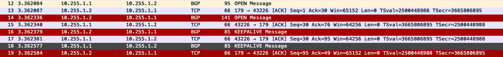

# FRRでBGP peerが貼れる様なBGPを作る(2)
* KEEPALIVE Msg を交換し、Establishedになるまで実装.

---
### Usage: 
  ~~~
  $ ./mybgp conf.json 
  The json file describes the configuration.
  ~~~

---
### Json File:
  - 記述例.
  ~~~
  {
      "router bgp": 1, 
      "router-id": "1.1.1.1", 
      "neighbor": 
      {
          "address": "10.255.1.2", 
          "remote-as": 2
      }
  }
  ~~~

---
### 実行例.
  ~~~
  ### R1 ###
  root@R1:/work# ./mybgp conf.json 
  --------------------
  Loaded the following settings.
  > myas  : 1
  > id    : 1.1.1.1
  > neighbor_address: 10.255.1.2
  > remote_as       : 2

  --------------------
  Trying to connect to 10.255.1.2 

  --------------------
  Sending OPEN MSG...

  --------------------
  BGP OPEN MSG RECV...
  Marker:  ff ff ff ff ff ff ff ff ff ff ff ff ff ff ff ff 
  Len: 75
  Type: 1
  Version: 4
  MyAS: 2
  HoldTime: 180
  Id: 2.2.2.2
  Opt_Len: 46

  --------------------
  Sending KEEPALIVE MSG...

  --------------------
  BGP KEEPALIVE MSG RECV...
  Marker:  ff ff ff ff ff ff ff ff ff ff ff ff ff ff ff ff 
  Len: 19
  Type: 4

  ESTABLISHED!
  ~~~
  
  ~~~
  ### R2 ###
  2# sh ip bgp summary 

  IPv4 Unicast Summary:
  BGP router identifier 2.2.2.2, local AS number 2 vrf-id 0
  BGP table version 3
  RIB entries 5, using 800 bytes of memory
  Peers 1, using 21 KiB of memory

  Neighbor        V         AS MsgRcvd MsgSent   TblVer  InQ OutQ  Up/Down State/PfxRcd
  10.255.1.1      4          1       0       0        0    0    0    never       Active

  Total number of neighbors 1
  
  ### R1でmybgpを実行した後 ###
  R2# sh ip bgp summary 

  IPv4 Unicast Summary:
  BGP router identifier 2.2.2.2, local AS number 2 vrf-id 0
  BGP table version 3
  RIB entries 5, using 800 bytes of memory
  Peers 1, using 21 KiB of memory

  Neighbor        V         AS MsgRcvd MsgSent   TblVer  InQ OutQ  Up/Down State/PfxRcd
  10.255.1.1      4          1       2       2        0    0    0 00:00:03       Active

  Total number of neighbors 1
  ~~~

---
### Wireshark.

  

